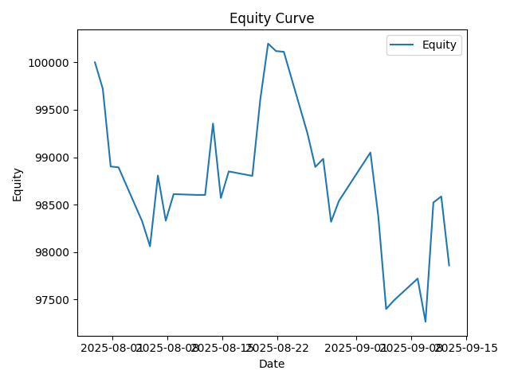
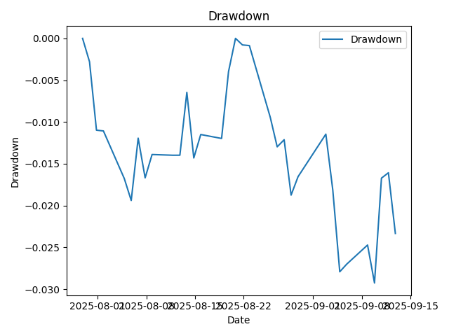
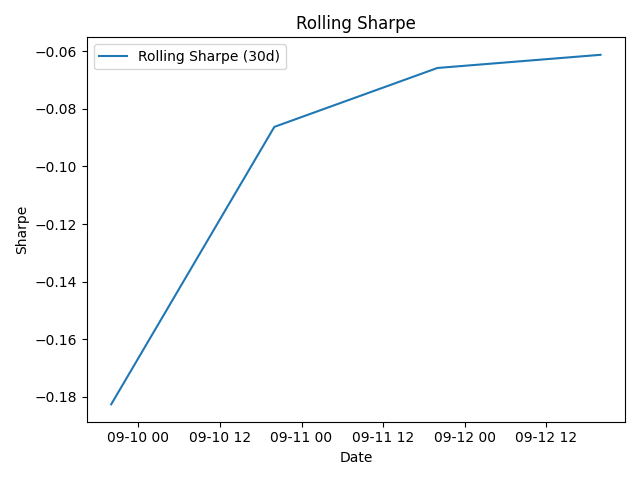
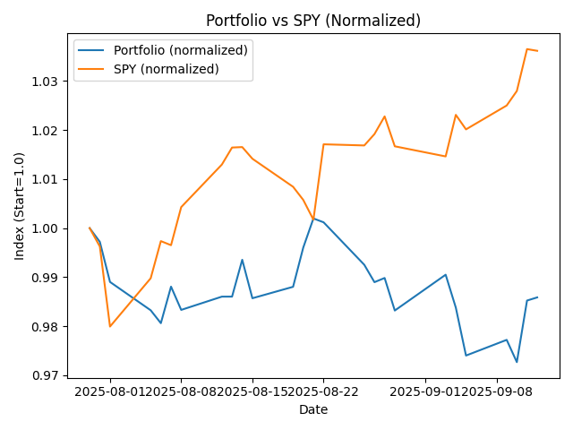

# Algo Trader

A modular algorithmic trading framework in **Python** for both **live trading** (Alpaca) and **historical backtesting**. It includes automated performance reporting, SPY benchmarking, and reproducible trade logs.

---

## Features
- **Live trading** with Alpaca (`src/live_trade.py`)
- **Backtesting** on historical data (`src/backtest.py`)
- **Strategies** (see `src/strategy.py`):
  - `WeeklyReversal` — cross-sectional 1-week mean-reversion
  - `CrossSectionalReversal` — bottom-k contrarian over a configurable lookback
  - `PairsTrading` — cointegration-based pair using `statsmodels.coint`
  - `LowVol` — low-volatility tilt
  - `CoveredCalls` — covered-call overlay (simplified)
  - `CompositeStrategy` — blends multiple strategies with weights
- **Data utilities** (`src/data_fetch.py`)
- **Automated reporting** (`generate_stats.py`)
  - Equity curve, drawdown, rolling Sharpe, SPY comparison (alpha/beta/R²), per-order realized PnL, monthly returns table
- **Universe management** (`tools/update_symbols.py`) — refreshes `symbols.txt` with a SPY-like Top-N subset
- **Human-readable trade logs** in `trades/` (daily Markdown files)

---

## Project Structure (high level)
- `src/` — strategies, backtest runner, live trading, data fetch
- `tools/` — helper scripts (e.g., `update_symbols.py`)
- `report/` — generated charts & CSVs (created by `generate_stats.py`)
- `data/raw` & `data/clean` — cached market data
- `trades/` — dated Markdown logs of executed trades
- `symbols.txt` — current trading universe (one ticker per line)
- `generate_stats.py` — builds lifetime performance report from Alpaca
- `.github/workflows/daily-trade.yml` — optional scheduled live trade runner

---

## Installation
```
git clone https://github.com/dshan12/algo-trader.git
cd algo-trader
python -m venv .venv
# macOS/Linux
source .venv/bin/activate
# Windows
# .venv\Scripts\activate
pip install -r requirements.txt
```

> Recommended Python: **3.10** (per `.python-version`).  
> Dependencies include: `alpaca-trade-api`, `pandas`, `numpy`, `statsmodels`, `matplotlib`, `yfinance`, `python-dotenv`.

---

## Configuration (Environment)

**Live trading (`src/live_trade.py`):**
- Uses:
  - `ALPACA_API_KEY`
  - `ALPACA_API_SECRET`

**Stats/reporting (`generate_stats.py`):**
- Accepts either set:
  - `APCA_API_KEY_ID`, `APCA_API_SECRET_KEY` *(preferred by Alpaca docs)*  
  - or `ALPACA_API_KEY`, `ALPACA_API_SECRET`
- Optional:
  - `APCA_API_BASE_URL` (defaults to paper: `https://paper-api.alpaca.markets`)

> Never commit secrets to the repo.

---

## Usage

### 1) Update the Trading Universe
Refresh `symbols.txt` with a SPY-like Top-N subset (keeps you under free API limits):
```
python tools/update_symbols.py --n 50 --format alpaca
# use --format yahoo to keep tickers like BRK.B
```

### 2) Backtest
Runs sample comparisons (weekly reversal horizons, pair trade, low-vol tilt, covered calls, and a composite):
```
python -m src.backtest
```

### 3) Live Trading (paper or live)
Executes end-of-day orders based on current signals:
```
python -m src.live_trade
```

### 4) Generate Lifetime Stats & Figures
Builds a lifetime (first→last) report from Alpaca `portfolio_history` + fills and benchmarks vs SPY:
```
python generate_stats.py
```
Artifacts are saved to `./report/`.

---

## Methodology

The framework separates **signals** (strategy) from **execution** (backtest/live) and **reporting**:

- **WeeklyReversal** — Cross-sectional 1-week mean-reversion: short recent 1-week winners, long 1-week losers (equal-weight; constraints in code).  
- **CrossSectionalReversal** — Bottom-k contrarian over a configurable lookback window (long the worst; see `lookback`/`bottom_k` in class init).  
- **PairsTrading** — Chooses a pair and tests cointegration with `statsmodels.coint`; trades the spread (long/short legs) when it diverges and mean-reverts.  
- **LowVol** — Selects lower-volatility names from the universe and allocates with an equal-weight tilt.  
- **CoveredCalls** — Simple covered-call overlay on long positions (payoff approximations are encoded in the class).  
- **CompositeStrategy** — Linear blend of the above with configurable weights.  
- **Backtesting** (`src/backtest.py`) reuses the same `generate_weights(...)` logic as live to ensure consistency.  
- **Reporting** (`generate_stats.py`) computes total/annual returns, vol, Sharpe/Sortino, max DD, realized PnL by order (FIFO), and **OLS alpha/beta vs SPY** (using `yfinance`).

---

## Result

Run `generate_stats.py` after you have trading history or a backtest; it writes:

**Charts**
- `report/equity_curve.png`  
- `report/drawdown.png`  
- `report/rolling_sharpe_30d.png`  
- `report/equity_vs_spy.png`

**Tables/CSVs**
- `report/monthly_returns_heatmap.csv`  
- `report/per_order_realized_pnl.csv`  
- `report/per_symbol_realized_pnl.csv`  
- `report/fills.csv`

**Quick gallery (auto-generated figures from this repo)**





---

## Automation (optional)

A GitHub Action (`.github/workflows/daily-trade.yml`) is included to run live trading EOD:
- Schedule: `21:05 UTC` on weekdays
- Secrets used: `ALPACA_API_KEY`, `ALPACA_API_SECRET`, and `PAT` (GitHub token)
- Runner command:
  ```
  python -m src.live_trade
  ```

---

## Troubleshooting

- **No portfolio history / empty figures** → Ensure Alpaca keys are set and the account has history; for testing, run a backtest first.  
- **SPY benchmark missing** → Install `yfinance` (see `requirements.txt`) and ensure network access.  
- **Universe too large / rate limits** → Use `tools/update_symbols.py --n 50` to keep a compact, SPY-like set.  
- **Python version** → The repo’s `.python-version` is **3.10**; use 3.10+ for best compatibility with pinned deps.

---

## License
MIT — see `LICENSE`.
